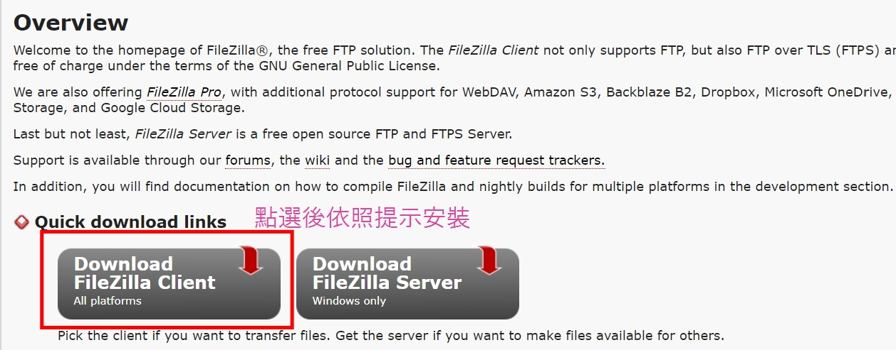
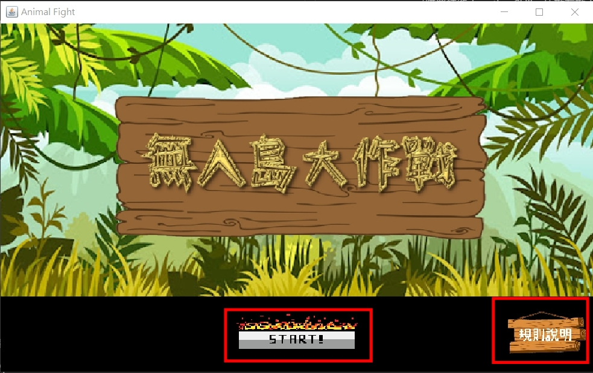

## 第13組_OOPII_Project_無人島大作戰
#### 一、安裝開發軟體工具
1. X2GO安裝與設定
	- (1)點選下方連結安裝X2GO 
	[Windows](https://wiki.x2go.org/doku.php/doc:installation:x2goclient) 
	 
	[其他OS系統下載點](https://wiki.x2go.org/doku.php/download:start) 
	- (2)安裝完成後新增工作階段 
	依照後方順序點選:左上角工作階段(S)->新增工作階段(N)... 
	- (3)依照圖示完成工作階段偏好設定 
	 
2. FileZilla安裝與設定
	- (1)點選下方連結安裝FileZilla 
	[FileZilla](https://filezilla-project.org/) 
	 
	- (2)安裝完成後之設定 
	 
#### 二、開發遊戲之安裝與測試步驟
1. 登入X2GO
2. 用cd指令到**第13組_OOPII_Project_Final**所在之目錄下 
3. 於指令欄輸入**javac Run.java**後按下Enter鍵編譯檔案 
4. 接者輸入**java Run**後按下Enter鍵即可執行程式 
5. 螢幕上出現下方圖片即完成安裝! 
#### 三、各檔案之性質說明
**Run.java**: 遊戲的主程式，使用者可直接執行此程式開始遊戲。 
**InfoFileReader.java**: 負責讀取地圖和角色檔案 
**MusicPlay.java**: 負責控制背景音樂播放的多執行緒 
**Map.java**: 負責讀取當前的地圖資訊 
**Game.java**: 負責執行和控管遊戲進行 
**Wallet.java**: 負責控管玩家戰鬥時的花費與收入 
**Role.java**: 負責初始化物種資料與戰鬥會使用到的動作 
**PlayerRole.java**: 繼承Role類別負責儲存我方戰士的資料 
**EnemyRole.java**: 繼承Role類別負責儲存敵方戰士的資料 
**Player.java**: 負責更新與控制我方場上的已召喚物種 
**Enemy.java**: 負責更新與控制敵方場上已召喚物種 
**GameFrame.java**: 包含開始遊戲和規則說明按鈕的介面 
**MapFrame.java**: 可點選任一地圖編號的介面 
**ArrangeFrame.java**: 負責顯現所有動物資訊與玩家當前隊伍的介面 
**FightFrame.java**: 負責將玩家點選之動物召喚上場並更新雙方戰況、城堡資訊和錢包餘額。 
#### 四、遊戲規則與操作說明
1. 遊戲規則 
	(1)玩家面:
	- 玩家可以從12之角色中挑選1-5隻動物，點擊SAVE按鍵，作為你這局的小兵，開始遊戲。
	- 一回合只能點選其一種技能，Don’t want to call，或出取一隻小兵。
	- 遊戲中會有錢包，每回合增加50元，可藉由購買Accelerate Wallet來提升產出金錢的額度，最高只能提升每回合增加250元。
	- 若錢包不足，只能選擇Don’t want to call，結束這回合。
	- 可以由錢包購買小兵上陣與敵方對戰，以攻擊對方的主堡。
	- 擊殺敵方小兵可賺取10元。
	- 可購買技能- Attack Skill，來攻擊場上所以敵方300滴血。
	- 可購買技能-Location Skill，使敵方敵人後退一小段距離。
	- 當敵方的主堡血量歸0，玩家獲得勝利，若己方主堡歸0，玩家失敗。

	(2)遊戲面:
	- 藉由玩家使用小兵，攻擊電腦方小兵，以攻擊電腦方主堡，使電腦方主堡血量歸0。
	- 主堡血量歸0方失敗，另一方獲勝。
	- 電腦方每回合會任意從12隻小兵中，出取1隻小兵。
	- 電腦方不會使用Attack Skill、Location Skill、Accelerate Wallet三項技能。
	- 電腦方不會使用Don’t want to call。
2. 操作說明 
(1)執行遊戲後第一個介面 
- 按下**規則說明**按鍵後跳出規則說明視窗(圖二) 
- 按下**START!**按鍵進入選擇地圖介面(圖三) 
 

(圖一)

規則說明視窗 

 

(圖二)

(2)選擇地圖的介面(數字1~9代表地圖編號) 

 

(圖三)

(3)編輯我方隊伍介面 
- 按下**加入隊伍**即可將動物加入下方隊伍列(圖五) 
- 按下**更多資訊**查看所選動物之簡介(圖六) 
若玩家想加超過五隻動物進入隊伍列則跳出提醒視窗(圖七) 

(圖四)

(圖五)

(圖六)

(圖七)

(4)戰鬥介面 
當下方按鍵發亮時代表可點選使用 
否則代表該動物或技能尚無法被召喚或使用 

(圖八)

當某一方的城堡血量歸零時跳出提示視窗 
- 按下**again**則回到編輯隊伍介面重新準備在同張地圖下的戰鬥 
- 按下**return map**則回到選擇地圖介面重新選擇欲挑戰之地圖編號 
- 按下**next stage**則回到編輯隊伍介面重新準備到下張地圖進行戰鬥 

(圖九)
